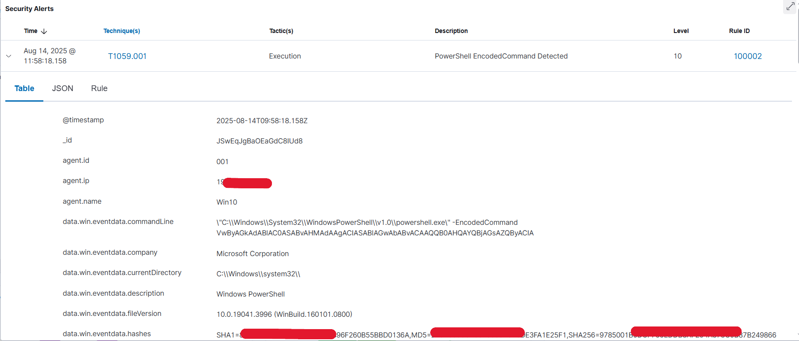
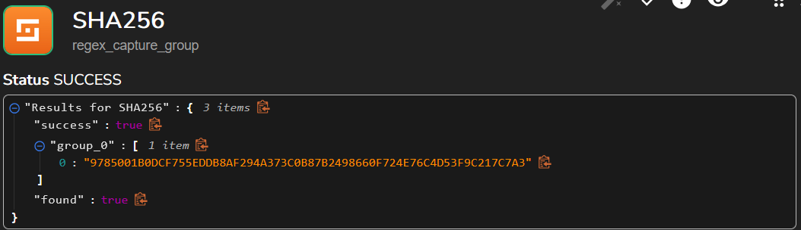

🔍 PowerShell EncodedCommand Detection & Automated Response

This project demonstrates how to detect malicious PowerShell commands using the -EncodedCommand flag with Wazuh, then automate the incident response using Shuffle.io, TheHive.

### 🛠 Steps

1️⃣ Wazuh Custom Rule 

To create this rule, edit ```sudo nano
/var/ossec/etc/rules/local_rules.xml```
 on the Wazuh Manager, add the <rule> block with the desired id, field pattern, description, and MITRE tag, then restart the Wazuh Manager to apply changes.


```xml
<rule id="100002" level="10">
  <if_sid>92057</if_sid>
  <field name="win.eventdata.commandline" type="pcre2">(?i)-encodedcommand</field>
  <description>PowerShell EncodedCommand Detected</description>
  <mitre>
    <id>T1059.001</id>
  </mitre>
</rule>
```


This Wazuh rule detects the execution of PowerShell commands using the -EncodedCommand parameter, which is commonly leveraged by attackers to obfuscate malicious scripts and evade detection. Triggered when the specified pattern is found in win.eventdata.commandline logs, with a high severity level (10). Associated with MITRE ATT&CK technique T1059.001 (PowerShell).

2️⃣ Testing

Run Administrator PowerShell on a Windows system with Wazuh Agent:

```xml
$command = 'Write-Host "Hello Attacker"'
$bytes = [System.Text.Encoding]::Unicode.GetBytes($command)
$encodedcommand = [Convert]::ToBase64String($bytes)
$encodedcommand
VwByAGkAdABlAC0ASABvAHMAdAAgACIASABlAGwAbABvACAAQQB0AHQAYQBjAGsAZQByACIA
```
```xml
powershell.exe -EncodedCommand VwByAGkAdABlAC0ASABvAHMAdAAgACIASABlAGwAbABvACAAQQB0AHQAYQBjAGsAZQByACIA
Hello Attacker
```

🛡️ This PowerShell example encodes the ```command Write-Host "Hello Attacker"``` into Base64 using ```[System.Text.Encoding]::Unicode.GetBytes()``` and ```[Convert]::ToBase64String()```. Attackers often use this -EncodedCommand technique to hide the real command and evade basic detection, making it a common indicator for malicious PowerShell activity.


3️⃣ The alert should appear in Wazuh Dashboard.

⚠️ High-Severity Alert — Wazuh detected the execution of a PowerShell command using the -EncodedCommand parameter on host Win10 (xx.xx.xx.xx). This technique (MITRE ATT&CK T1059.001) is commonly used by attackers to run obfuscated scripts and evade detection. The captured command was encoded in Base64, indicating a possible malicious or stealth activity requiring immediate investigation.




4️⃣ Wazuh → Shuffle Integration

Add to ```/var/ossec/etc/ossec.conf```:

```xml
<integration>
    <name>shuffle</name>
    <hook_url>https://shuffler.io/api/v1/hooks/webhook_xxxxxxxxxxx->
    <rule_id>100002</rule_id>
    <alert_format>json</alert_format>
</integration>
```
Restart Wazuh Manager:
```xml
sudo systemctl restart wazuh-manager
```


1.🔄This is the first step in the automation workflow: The Shuffle platform receives "Alerts" from the Wazuh Manager:




2.📊This stage highlights a crucial step in the automation workflow, where data related to a security alert is enriched. The process begins by receiving an alert from Wazuh, which leads to:

Hash Calculation (SHA256): The SHA256 hash value of the threat or suspicious file is automatically calculated.
VirusTotal Query: The hash value calculated in the previous step is used to send an automated query to the VirusTotal platform.
Getting a Report: The required action from VirusTotal is to "Get a hash report," which provides detailed information about the file's reputation and associated threats.

This stage aims to provide threat intelligence data quickly and automatically, helping the security analyst make more informed decisions faster.3


🚨 Summary of Key Data from VirusTotal Report

| Field | Details |
|:---|:---|
| Name | PowerShell.EXE |
| Hash (SHA256) | 9785001b0dcf755eddb8af294a373c0b87b2498660f724e76c4d53f9c217c7a3 |
| Detection | 24 malicious, 17 harmless |
| Sandbox Verdict | MALWARE (from Yomi Hunter and Zenbox) |
| Sigma Rules | 1 high, 2 medium, 1 low |
| Reputation | -22 |
| Original Product | Microsoft® Windows® Operating System |
| Publisher | Microsoft Corporation |

🚨 The diagram illustrates the role of TheHive platform in security incident management.
After the security alert is enriched with data from VirusTotal, it is automatically converted into a new alert in TheHive :


